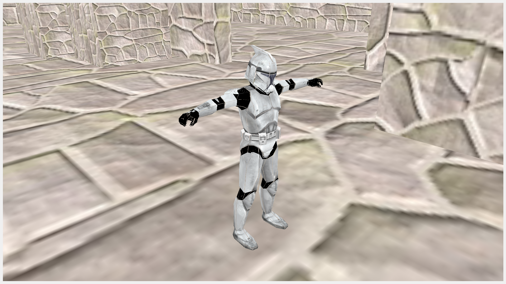

# OldRenderEngine
This was a Render Engine made during school and was used for school projects. It is made with OpenGL and is capable of raycasting, transfering a .obj file to a binary file for faster reading, and A-Star Pathing.

### Binary Alpha
Alpha transparency, self explanatory

### Explosion
Using a geometry shader and normals (or calculated normals in my example) I was able to translate the triangles for a model across the normal, creating an explosion like effect.

### Water
Using a a plane with multiple triangles and sine/cosine waves, I create a plane that is very rudimentary water.

### CubeMap
Implemented skyboxes

### Shadows
Created a depth map to make shadows that can even cast onto the same model.

### Dynamic Environment Refraction
Applied cubemaps knowledge and framebuffers to make a cloaking effect

### Normal Mapping
Applied Normal Mapping to give better detail

### Parallax Mapping
Turn a plane to look 3-D, by giving it depth via just an image file

### Deferred Shading
Used the Deferred Shading lighting technique, I had to find and use new models that had the specular data(texture/map) I needed

### Decals
Failed attempt to add sprays/decals to the engine. I never got it working in this engine.
